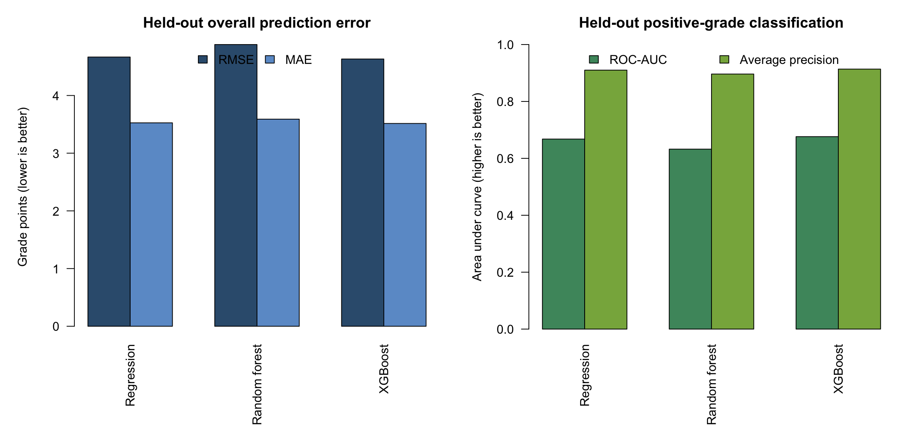
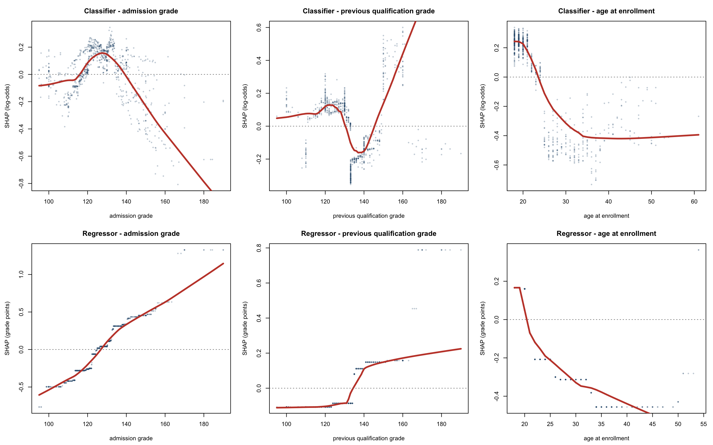

# Linear Regression XGBoost Extension

This repository contains a STA302 group report on first-year university grades and a separate predictive extension by Yi Zhao. The extension uses a two-stage model: a classifier estimates the probability of a positive recorded grade, and a regressor estimates grade conditional on a positive outcome. Their product is the predicted grade for the full sample.

The predictive comparison uses the same five enrollment-time variables for logistic-plus-log-linear regression, random forest, and XGBoost. Model selection uses five-fold development cross-validation within a fixed 80% training split. The final comparison uses one untouched 20% test set.

## Authorship and scope

- Predictive extension and reproducibility file: Yi Zhao.
- Original linear-regression report: Emilia Li, Jingxiu Zeng, Felix Zhao, Shimin Zeng, and Siqi Yang.
- The original group PDF is preserved byte for byte. Its SHA-256 is `2b09785ec62a7a5cf024e18c644587a86bccc4b13243a22b3817b6e820d57f2e`.

## Verified results

The held-out test set contains 886 records, including 750 positive recorded grades and 136 zeros.

| Test target and scale | Regression | Random forest | XGBoost |
|---|---:|---:|---:|
| Positive-grade classifier ROC-AUC | 0.668 | 0.632 | 0.676 |
| Positive-grade classifier average precision | 0.910 | 0.896 | 0.914 |
| Positive-only conditional RMSE, grade points | 2.041 | 2.041 | 2.030 |
| Full-sample RMSE, grade points | 4.667 | 4.883 | 4.632 |
| Full-sample MAE, grade points | 3.526 | 3.590 | 3.515 |
| Full-sample R-squared | 0.072 | -0.016 | 0.085 |

XGBoost's full-sample RMSE was 0.034 lower than the regression benchmark, but the paired bootstrap 95% interval included zero (`-0.089` to `0.025`). Its RMSE was 0.251 lower than random forest, with a 95% interval of `-0.363` to `-0.131` for XGBoost minus random forest.

Test-set SHAP summaries showed a non-monotone admission-grade contribution to positive-grade classification, increasing admission-grade contributions to conditional grade above roughly 125 to 130, and increasingly negative age contributions after the early twenties. Scholarship category 1 had a positive mean contribution and gender category 1 had a negative mean contribution in both stages. These statements describe the fitted models, not causal effects.





## Files

| Path | Purpose |
|---|---|
| `reports/original_linear_regression_report.pdf` | Unmodified original group report |
| `reports/xgboost_extension_report.pdf` | Revised predictive extension, authored by Yi Zhao |
| `Final Project.Rmd` | Readable, relative-path reproduction code with report-to-code labels |
| `manuscript/xgboost_extension_manuscript.md` | GitHub-readable manuscript text corresponding to the extension PDF |
| `data/data_raw.csv` | Supplied raw dataset |
| `data/clean_model_data.csv` | Name-normalized derivative with `grade_year1` added |
| `results/` | Metrics, tuning records, split membership, SHAP summaries, figures, and session information |
| `integrity/integrity_audit.md` | Final data, code, result, citation, and provenance audit |

## Report-to-code map

Comments in `Final Project.Rmd` identify every manuscript output:

| Report item | Reproduction output |
|---|---|
| Section 2, Table 1 | `sample_characteristics.csv` |
| Sections 3.1 and 4.1, Table 2 | `inferential_model_table.csv`, `inferential_model_fit.csv` |
| Section 3.3, Tables 3 and 4 | `cv_fold_metrics.csv`, `cv_summary.csv`, `metrics.csv` |
| Section 3.3, Table 5 | `bootstrap_comparisons.csv` |
| Section 4.4, Table 6 | `shap_importance.csv`, `shap_binary_summary.csv` |
| Figure 1 | `performance_overview.png` |
| Figure 2 | `shap_dependence.png`, with binned values in `shap_dependence_summary.csv` |

## Reproduce the extension

The verified run used R 4.4.0, xgboost 3.2.1.1, and randomForest 4.7-1.2.

```r
install.packages(c("rmarkdown", "xgboost", "randomForest"))
rmarkdown::render("Final Project.Rmd")
```

Run the command from the repository root. The analysis uses seed `3022026` and writes derived files to `results/`. It does not modify the source data or PDFs.

## Data provenance

The source is the [UCI Predict Students' Dropout and Academic Success dataset](https://archive.ics.uci.edu/dataset/697/predict+students+dropout+and+academic+success), DOI [10.24432/C5MC89](https://doi.org/10.24432/C5MC89), licensed under CC BY 4.0. The cleaned file retains the 37 supplied columns after name normalization and adds `grade_year1`, the arithmetic mean of the two semester grade fields. See `data/README.md` for checksums and the exact transformation.

## Interpretation limits

The dataset comes from one Portuguese institution. The model uses five enrollment variables and one held-out split. A recorded zero means that both semester grade-average fields are zero; the available fields do not identify one common mechanism. Full-sample R-squared is low, no external validation was performed, and subgroup error or calibration analysis was outside scope. The results should not be used for individual admissions, funding, or academic-support decisions.

## Development note

OpenAI Codex assisted with predictive implementation, verification, figure generation, and editing. Yi Zhao is responsible for the final review, analysis decisions, and public release.

## References

- Realinho, V., Vieira Martins, M., Machado, J., and Baptista, L. (2021). *Predict Students' Dropout and Academic Success* [Data set]. UCI Machine Learning Repository. https://doi.org/10.24432/C5MC89
- Realinho, V., Machado, J., Baptista, L., and Martins, M. V. (2022). Predicting student dropout and academic success. *Data, 7*(11), 146. https://doi.org/10.3390/data7110146
